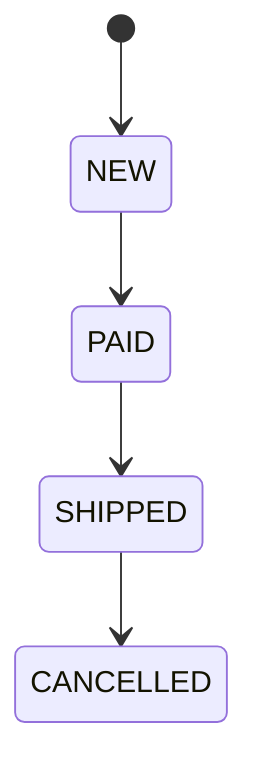
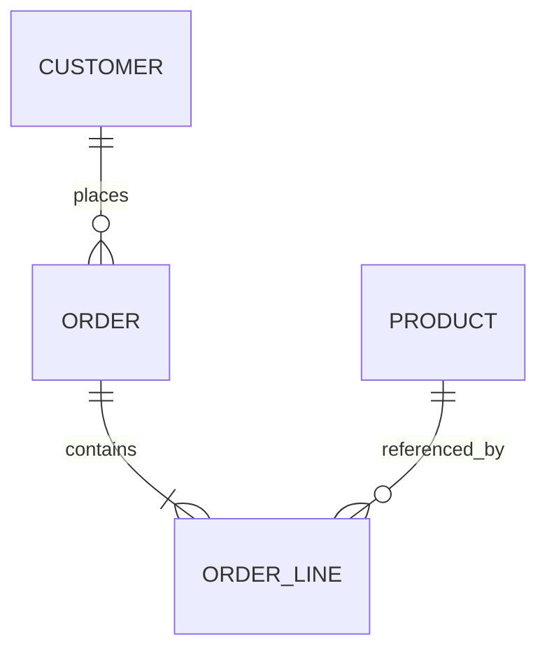

# OrderHub

OrderHub is a Spring Boot 3.5 order-management API using Java 21, PostgreSQL, JPA, Flyway, Spring Security HTTP Basic, springdoc OpenAPI and Actuator.

## Run

Local Gradle commands require JDK 21 and Docker for integration tests; Docker-only startup requires Docker/Compose. The Gradle 8.14.3 wrapper downloads its distribution on first use. Spring Boot is 3.5.7 and springdoc is 2.8.14. Testcontainers is pinned to 1.21.4 for Docker 29 compatibility ([release notes](https://github.com/testcontainers/testcontainers-java/releases/tag/1.21.4)).

```bash
export JAVA_HOME=/path/to/jdk-21
./gradlew test
docker compose up -d --build
# after the stack is healthy:
./scripts/smoke.sh
```

For local development, start only PostgreSQL and run Spring Boot with JDK 21:

```bash
docker compose up -d postgres
./gradlew bootRun
```

The Docker image runs without a host JDK. Stop services with `docker compose down`; omit `-v` to preserve the database volume.

If ports `5432` and `55432` are already occupied, use for example:

```bash
POSTGRES_PORT=55439 APP_PORT=18089 docker compose up -d --build
BASE_URL=http://localhost:18089 ./scripts/smoke.sh
```

The API is at `http://localhost:8080`; Compose exposes PostgreSQL on `localhost:55432` by default (override with `POSTGRES_PORT`) to avoid collisions. Health is `/actuator/health`, OpenAPI JSON is `/v3/api-docs`, and Swagger UI is `/swagger-ui/index.html`. Compose configures `DB_URL`, `DB_USER`, `DB_PASSWORD`, `USER_PASSWORD`, and `ADMIN_PASSWORD`; `APP_PORT` and `POSTGRES_PORT` are also supported. Local `.env` overrides are supported and must not be committed. Tests use Testcontainers and need a running Docker daemon. `scripts/smoke.sh` requires Bash, curl and Python 3, uses seeded product 1 and verifies lifecycle, authentication and OpenAPI behavior.

The verified Compose session is available at [Swagger UI](http://localhost:18089/swagger-ui/index.html) when started with the alternate port example below.

Demo credentials are `user` / `user-local` and `admin` / `admin-local`. Each login has a matching seeded customer profile; `other` is an additional domain fixture used for ownership isolation and is not a login account. Money is represented in PLN.

## API

Endpoints use stateless HTTP Basic. CSRF is disabled for this demo API; use HTTPS outside localhost. There is no registration flow or UI.

```bash
curl -u user:user-local http://localhost:8080/api/products
curl -u user:user-local http://localhost:8080/api/customers/me
curl -u user:user-local -H 'Content-Type: application/json' -d '{"lines":[{"productId":1,"quantity":2}]}' http://localhost:8080/api/orders
curl -u user:user-local 'http://localhost:8080/api/orders?page=0&size=20&status=NEW'
curl -u admin:admin-local -X PATCH -H 'Content-Type: application/json' -d '{"status":"PAID"}' http://localhost:8080/api/orders/1/status
```

Users read the catalog, create orders for their own customer profile, and list or view their own orders. Admins can manage products, list customers, see all orders, and advance order status. Product creation and status changes require `ADMIN`; failures use `application/problem+json`.





`/api/orders` supports creation, pagination, optional `status` filtering, and details. A request accepts at most 100 lines, each quantity is 1–1000, and page size is capped at 100. `POST /api/products` creates products; `GET /api/products` and `GET /api/products/{id}` read them. `GET /api/customers/me` reads the authenticated customer. `PATCH /api/orders/{id}/status` is admin-only. Order lines snapshot the product price at creation time. Status follows only the sequence in the diagram; there are no shortcut cancellations or reverse transitions.

## Structure and scope

`com.orderhub.domain` contains entities and the strict status machine, `com.orderhub.api` contains REST models/controllers/services and problem responses, and `com.orderhub.infrastructure` contains persistence, security, OpenAPI and configuration. Flyway migrations are under `src/main/resources/db/migration`.

Default environment values are `DB_URL=jdbc:postgresql://localhost:55432/orderhub`, `DB_USER=orderhub`, `DB_PASSWORD=orderhub-local`, `USER_PASSWORD=user-local`, `ADMIN_PASSWORD=admin-local`, `APP_PORT=8080`, and `POSTGRES_PORT=55432`.

The MVP excludes Kafka, reactive WebFlux, registration, and a UI. JWT can replace Basic authentication when integrated with an identity platform.
